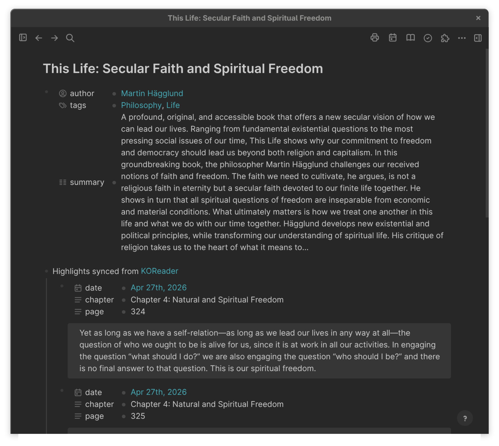
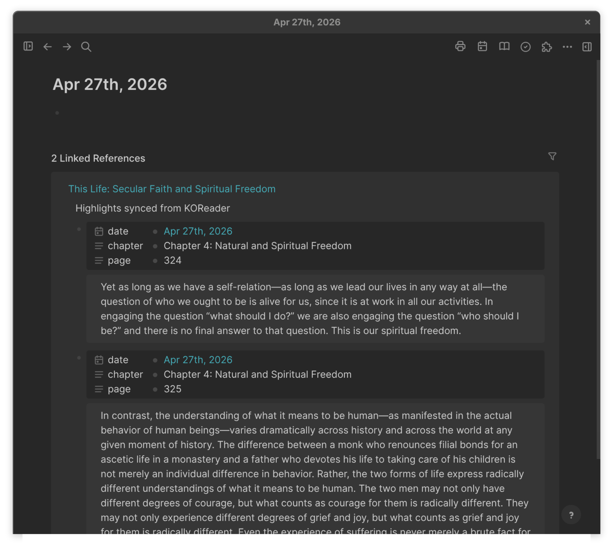
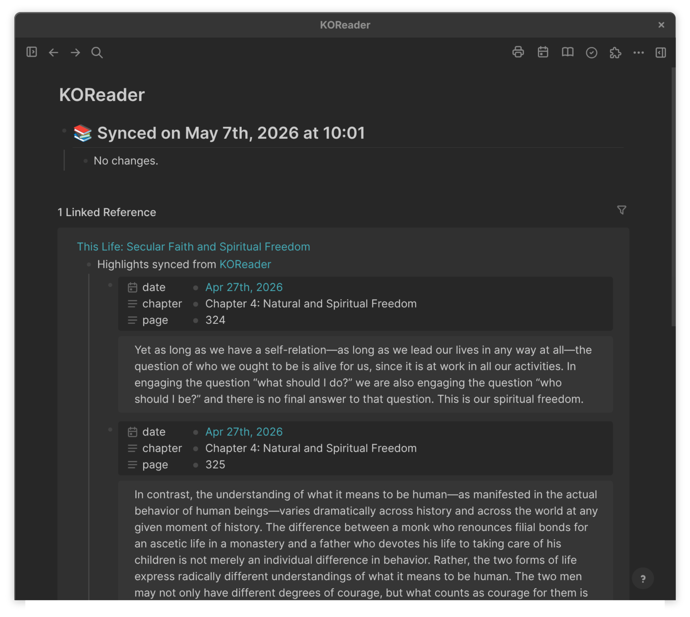

# Sync KOReader Highlights

Last updated: 2026-07-20 05:49 AM CDT

[](https://github.com/CR0CKER/sync-koreader-highlights/actions/workflows/ci.yml)
[](LICENSE)
[](https://github.com/CR0CKER/sync-koreader-highlights/releases)

A Logseq plugin that imports your [KOReader](https://koreader.rocks/)
highlights, notes, and bookmarks into your Logseq graph — one Logseq
page per book, with rich properties, journal-day backlinks, and an
idempotent replace-on-change sync model.

> **Inspiration & credits.** This plugin was inspired by two prior
> works:
>
> - [`isosphere/logseq-koreader-sync`](https://github.com/isosphere/logseq-koreader-sync)
>   for showing that KOReader sidecars can be parsed in-browser via
>   `luaparse` and the File System Access API. No code is reused; the
>   layout, sync engine, and rendering pipeline here are written from
>   scratch with a different design.
> - [`readwiseio/logseq-readwise-official-plugin`](https://github.com/readwiseio/logseq-readwise-official-plugin)
>   for the per-book-page UX, the property-based metadata model, and
>   the toolbar/index-page conventions that this plugin mirrors.
>
> Thank you to both projects.

> **AI-assisted development.** This plugin was built with substantial
> help from [Claude Code](https://www.anthropic.com/claude-code).
> If that matters to you, read the source before you load the plugin into your graph.

> **Use at your own risk.** This software is provided "as is",
> without warranty of any kind, express or implied. The author
> accepts no liability for data loss, graph corruption, lost
> highlights, broken syncs, or any other damages arising from the
> use of this plugin. **Always back up your Logseq graph before
> trying any new plugin, including this one.** See the [LICENSE](./LICENSE)
> for the full disclaimer.

## Tested with

- **KOReader 2025.04** on Android (annotations and bookmarks
  written to `metadata.*.lua` sidecars, propagated to the desktop
  via Syncthing or any other file-level sync).
- **Logseq 0.10.x** on Linux (Asahi Fedora aarch64) and macOS.
  The plugin uses only Logseq's standard JS plugin API, so
  Windows and other Linux distros are expected to work too; they
  have not been exhaustively tested.

## Status

Public beta. Working end-to-end against a real Calibre + KOReader
library. Available on the Logseq plugin marketplace as **Sync
KOReader Highlights** — open Logseq → ⋯ menu → Plugins →
Marketplace → search for "KOReader". You can also load the
repository as an unpacked plugin if you prefer (see
[Loading in Logseq](#loading-in-logseq) below).

## How it works

1. Click the **book icon in the Logseq toolbar** to open the sync
   panel.
2. In the panel, click **Choose KOReader directory…** and pick the
   folder containing your KOReader sidecar `metadata.*.lua` files
   (typically your Calibre library, or whatever folder Syncthing
   pulls from your reader).
3. Click **Sync now**. The progress log streams in the panel; on
   completion a toast summarises new books and new highlights.
4. Subsequent syncs reuse the remembered directory — no re-picking
   unless you click "Choose KOReader directory…" again.
5. Each sync writes one Logseq page per book, updates the
   `[[KOReader]]` index page, and adds journal-day backlinks so
   every highlight surfaces on the day it was made.

> **⚠️ Don't edit highlights in place.** The plugin keeps each book's
> highlights in lockstep with KOReader by **rebuilding the entire
> `Highlights synced from …` block on every change-bearing sync** — so
> any edits you make *inside* that block (rewording a quote, tweaking a
> `date::`) are overwritten the next time that book's highlights change on
> the device. This is deliberate: it's how highlights you delete on the
> reader also disappear from Logseq. Anything you write **outside** that
> block — elsewhere on the book page, in child blocks of your own, on the
> journal day — is never touched. Put your own notes there.

Advanced knobs (Mustache templates for the book-page header,
highlights heading, and per-highlight block; auto-sync interval;
the directory-handle persistence toggle) live in the standard
Logseq plugin settings dialog — reach it via the panel footer's
**Open plugin settings…** link or the regular Plugins → ⚙ flow.

## Multiple graphs

The plugin writes to a **single graph**, chosen the first time you
sync. Logseq runs every plugin against whichever graph is currently
open, so without a guard a sync — or an automatic/launch sync — fired
while a *different* graph was open would scatter KOReader book pages
across unrelated graphs.

To prevent that, the plugin **binds to one graph on the first sync** and
refuses to write anywhere else:

- The sync panel shows a **Graph** row with the bound graph's name and a
  **Bind / Re-bind to this graph** button.
- The first **Sync now** binds the currently-open graph automatically.
- Open a *different* graph and **Sync now** is disabled with a warning;
  background-interval and launch syncs silently skip.
- Click **Re-bind to this graph** to move the binding to the open graph.
  Because the per-book tracking state describes the previously-bound
  graph, re-binding resets that state — pages already written in the old
  graph are left untouched for you to remove manually (e.g. via
  *reset and delete all book pages* while that graph is open).
- The `Sync KOReader Highlights: unbind graph` command clears the
  binding; the next sync re-binds to whatever graph is open.

## Screenshots

A book page with KOReader-derived properties (author, tags, summary)
and the synced highlights below:



A journal day, showing every highlight made on that date as a Linked
Reference — produced automatically by the `date::` page-link on each
highlight block, with no plugin-authored blocks on the journal page:



The `KOReader` index page, where each sync writes a receipt and every
synced book backlinks via the `[[KOReader]]` mention in its highlights
heading:



## What it does

### Per book

- **One Logseq page per book.** Page name comes from the KOReader
  sidecar's `doc_props.title`, with the following sanitisation so
  the name doesn't break Logseq's wikilink / page-creation rules:
  - `[` / `]` → `(` / `)`
  - `:` → ` — ` (so titles like
    `This Life: Secular Faith and Spiritual Freedom` become
    `This Life — Secular Faith and Spiritual Freedom` for the page
    address; the colon-bearing original lives in the `title::`
    property and renders correctly in Logseq's UI).
  - Title collisions get disambiguated as `<title> — <authors>` or
    `<title> (n)`.

- **Page-level properties** (defined by the customisable
  Book-page header template and written via Logseq's structured
  `createPage(name, properties, opts)` API so Logseq escapes them
  natively). The default template produces:
  - `author::` — each KOReader author rendered as its own
    `[[wikilink]]`. Names containing `Last, First` commas are split
    only on KOReader's `\n` separator, never on commas inside a name.
  - `full-title::` — full original title, including any colons.
  - `series::` — single `[[wikilink]]` from `doc_props.series`
    when present.
  - `category:: #Books` — a constant tag so every synced book is
    grouped under the `Books` page.
  - `summary::` — the full `doc_props.description`, with HTML tags
    stripped, named/numeric HTML entities decoded, and Lua escapes
    resolved. Not truncated.
  - `tags::` — comma-joined `[[wikilinks]]`, sourced from
    `doc_props.keywords` (or `doc_props.subject` as fallback).
    Split on `;`, `,`, and newlines so KOReader's multi-line
    keyword form (`Philosophy\<newline>Life`) yields two distinct
    tags.

  All values are sanitised before being written: newlines collapsed,
  duplicate `::` neutralised, whitespace trimmed. Empty values cause
  their property line to drop out entirely. Edit the Book-page
  header template setting to add, remove, or rename any of these.

- **Highlights / notes / bookmarks** (KOReader stores all three in
  the `annotations` table; the renderer disambiguates by which
  fields are populated):
  - **Highlight** (`text` non-empty) → block content `> {text}`,
    optional KOReader-side note attached as a child block.
  - **Note alone** (`text` empty, `note` non-empty) → the note text
    becomes the block body (no blockquote prefix, no `Bookmarked`
    placeholder).
  - **Page bookmark** (both empty) → block content `> Bookmarked`.

  Each block carries structured properties — order: `date`,
  `date-updated`, `chapter`, `page`. The `date` value is a
  `[[<journal-day>]]` page-link formatted with the user's
  `preferredDateFormat`, so Logseq's native Linked References panel
  surfaces every highlight on its journal day automatically (no
  plugin-authored blocks on the journal side). Standalone notes
  intentionally skip `date-updated`.

- **Highlights heading.** A single block per book, content
  `Highlights synced from [[KOReader]]`. The `[[KOReader]]` link
  gives you a backlink to every book on the index page. The
  heading intentionally omits a date because each highlight block
  already carries its own `date::` page-link to the journal day it
  was made.

### Per sync run

- **Idempotency state** lives in `logseq.settings`, not in graph
  block properties:
  - `bookIdsMap: { sidecarKey → { pageUuid, title } }` where
    `sidecarKey` is `md5:<partial_md5_checksum>` (stable across
    file moves and Calibre id changes) with a
    `meta:<authors>|||<title>` fallback for ancient sidecars.
  - `highlightIdsMap: { sidecarKey → { highlightId: true } }` —
    dedup set keyed by `<datetime>|<pos0>|<pos1>|<notes>|<text>`.
  - `lastHighlightDatetimeMap`, `lastSync`.

- **Replace-on-change update model.** When a sidecar's set of
  highlights differs from what's recorded in the dedup map (new
  ones added on the device, removed ones, or both), the existing
  `Highlights synced from …` block and its children are removed
  and rewritten in full from the current sidecar. No-op syncs
  (zero added, zero removed) leave the page completely untouched.
  Highlights deleted on the device drop out of Logseq too — the
  trade-off is that user edits to highlight blocks get lost on
  the next change-bearing sync. Edits to anything **outside** the
  `Highlights synced from …` block are preserved.

- **Existing-page protection.** When a Logseq page or the
  `KOReader` index page already exists at sync time, the plugin
  never overwrites user content:
  - On a book page, page-level properties are added only where
    they aren't already present, never updated.
  - The `Highlights synced from …` block lands at the bottom of
    the existing content; the user's prior blocks stay above.
  - On the `KOReader` index page, the sync receipt is **prepended**
    so it always sits at the top, with everything else below
    untouched. Old receipt blocks (both `## 📚 Sync …` and
    `## 📚 Synced on …` shapes) are removed before the new one
    drops in.

- **Books with zero items skipped.** Books whose sidecar has
  neither highlights nor notes nor bookmarks aren't synced at
  all — no Logseq page, no entry on the index page.

- **Stub-sidecar tolerance.** Sidecars without a populated
  `doc_props` (KOReader writes those for books opened-but-never-
  annotated, and re-collapses to that shape if you delete the last
  remaining annotation on the device) are silently skipped.

- **Numeric-keyed-table handling.** KOReader writes sequence-
  shaped values (annotations, multi-author/multi-tag fields) as
  Lua tables with explicit `["1"] = …, ["2"] = …` numeric-string
  keys rather than implicit sequences. The parser detects 1..N
  integer-keyed shapes and converts them to JS arrays so
  downstream code can iterate them.

### Sync receipt

A single `KOReader` index page receives a `## 📚 Synced on
<date> at <time>` block (rewritten on every sync that touches at
least one book) listing new books as `[[wikilinks]]` and existing
books that gained highlights with per-book counts.

## Loading in Logseq

### From the marketplace (recommended)

1. Plugins → ··· → **Marketplace** → search for "KOReader" →
   install **Sync KOReader Highlights**.
2. A book icon appears in the toolbar.
3. Click it to open the sync panel, then click
   **Choose KOReader directory…** and pick the folder containing
   your KOReader sidecars (typically your Calibre library or
   whatever folder Syncthing pulls from your reader).
4. Click **Sync now**.

### As an unpacked plugin (for development)

1. Plugins → ··· → **Load unpacked plugin** → point at this
   repository's root directory (after `npm run build`).
2. Same toolbar-icon → panel → pick → sync flow as above.

## Settings

In Logseq → Plugins → Sync KOReader Highlights → ⚙:

- **Remember Koreader directory** *(default on)* — persists the
  picked directory handle to IndexedDB so the picker is skipped
  on subsequent syncs and across Logseq restarts.
- **Auto-sync on Logseq launch** *(default off)* — runs a sync
  shortly after Logseq starts. See
  [Auto-sync limitations](#auto-sync-limitations) below.
- **Auto-sync interval (minutes)** *(default 0 = disabled)* —
  runs a sync every N minutes. Background ticks never prompt for
  the picker (they're a no-op when the directory hasn't been
  remembered yet), to avoid disrupting the user.
- **Book page header template** *(Mustache)* — defines the
  page-level properties on each book page. Pre-filled with a
  default that produces `author`, `full-title`, `series`,
  `category:: #Books`, `summary`, and `tags`. Add, remove, or
  rename properties by editing the template; the rendered output
  is parsed line-by-line as `key:: value` pairs and written
  through Logseq's structured `createPage` properties API for
  safe escaping (same path whether you keep the default or
  customise). Lines that don't match `key:: value` are dropped,
  so empty Mustache sections (`{{#series}}…{{/series}}`) collapse
  cleanly. Variables: `{{title}}`, `{{authors}}`,
  `{{authorsLinked}}`, `{{series}}`, `{{seriesLinked}}`,
  `{{tags}}`, `{{tagsLinked}}`, `{{language}}`, `{{summary}}`
  (alias `{{description}}`), `{{koreaderId}}`.
- **Highlights section heading template** *(Mustache; default
  `Highlights synced from [[KOReader]]`)* — always rendered
  through Mustache. Variables: `{{date}}` (current sync time),
  `{{kind}}` (`"initial sync"` or `"sync"`). Add them back to the
  template if you want a date-bearing heading.
- **Highlight block template** *(Mustache; default reproduces
  the inline-properties shape)* — when left at the default, the
  renderer uses Logseq's structured-properties API (safer
  escaping). When modified, the template owns the entire block
  content, including any inline `key:: value` lines you write.
  Variables: `{{text}}`, `{{date}}`, `{{dateUpdated}}`,
  `{{chapter}}`, `{{page}}`, `{{note}}`, plus boolean
  discriminators `{{isHighlight}}`, `{{isNote}}`,
  `{{isBookmark}}`. **A custom heading or block template's output is
  written to the block verbatim** — KOReader values are interpolated
  raw, with no HTML/markdown escaping, so a custom template owns any
  escaping its content needs. (The defaults never render raw: book
  properties and default highlight blocks go through Logseq's escaped
  structured-properties API.)

State maps (`bookIdsMap`, `highlightIdsMap`,
`lastHighlightDatetimeMap`, `lastSync`) plus the bound-graph
record (`boundGraph`) are stored in `logseq.settings` and not
exposed in the UI. The directory handle itself lives in IndexedDB
under `sync-koreader-highlights:directoryHandle`.

## UI

- **Toolbar icon** opens an in-plugin sync panel rendered inside
  the plugin's own iframe. The panel shows the currently-selected
  directory, the **bound graph**, the last-sync timestamp, a live
  progress log, and three buttons: **Choose KOReader directory…**,
  **Bind / Re-bind to this graph**, and **Sync now** (disabled when
  the open graph isn't the bound one — see
  [Multiple graphs](#multiple-graphs)). Closing the panel
  (X / backdrop click / ESC) returns to the main Logseq window.
- The panel matches your active Logseq theme (background, accent,
  text colours, font) by reading the host's `--ls-*` CSS
  variables on every open — Awesome Styler customisations
  propagate automatically.
- **Toasts** (`logseq.UI.showMsg`) report the completion
  summary (`Sync done — N new book(s), M new highlight(s), …`)
  and any errors.
- **Command palette** entries:
  - `Sync KOReader Highlights: open panel`
  - `Sync KOReader Highlights: reset sync state`
  - `Sync KOReader Highlights: reset and delete all book pages`
  - `Sync KOReader Highlights: forget remembered directory`
  - `Sync KOReader Highlights: unbind graph`
  - `Sync KOReader Highlights: reset templates to defaults`
- Mustache templates and auto-sync knobs live in the standard
  Logseq plugin settings panel — reach them from the panel's
  footer link ("Open plugin settings…") or the regular
  Plugins → ⚙ flow.

## Auto-sync limitations

The Readwise plugin's auto-sync just works because Readwise is
an HTTPS pull and needs no permission story. This plugin uses
the File System Access API, which Chromium drops the read
permission for on every Logseq restart. To re-grant permission
the plugin needs to call `requestPermission` *inside a user-
activation context* (i.e. a click or keypress event). The
plugin tries to defer the launch sync to the next user
activation by listening for `pointerdown` / `keydown`, but
Chromium does not always propagate user activation from the
plugin's iframe. When that happens the auto-sync silently
fails; a click on the toolbar icon (always a proper user-
activation context) re-grants and runs the sync.

The interval setting has the same limitation: a background tick
fires only when permission is currently granted in this session.

## Build

System Node 22+ (the project uses Vite 7 + TypeScript; vanilla
DOM, no UI framework). On Asahi Fedora aarch64, an x86-64 nvm
install can shadow the right binary, so:

```sh
PATH=/usr/bin:$PATH /usr/bin/npm install
PATH=/usr/bin:$PATH /usr/bin/npm run build
```

Output lands in `dist/` (one `index.html` + one bundled JS
asset, ≈180 KB).

### Checks

The same gates CI runs, locally:

```sh
PATH=/usr/bin:$PATH /usr/bin/npm run typecheck   # tsc --noEmit
PATH=/usr/bin:$PATH /usr/bin/npm test             # vitest run
```

Tests cover the pure parse/render layer (`src/sidecar.ts`,
`src/render.ts`) via `src/*.test.ts` — no `logseq` global or DOM
needed. Vitest uses its own `vitest.config.ts` (not `vite.config.ts`,
whose `vite-plugin-logseq` only runs in the dev-server path).

CI also runs two security gates (`.github/workflows/security.yml`),
both in digest-pinned containers — reproduce them with any OCI runtime
(`docker` or `podman`):

```sh
# SAST — fails on any finding
podman run --rm -v "$PWD":/src:z -w /src semgrep/semgrep:1.169.0 \
  semgrep scan --config p/security-audit --config p/javascript \
  --config p/typescript --config p/owasp-top-ten --config p/github-actions \
  --exclude node_modules --exclude dist --error

# Secrets across full git history + tree
podman run --rm -v "$PWD":/repo zricethezav/gitleaks:v8.30.1 git /repo
```

These complement GitHub's own secret scanning + push protection and the
Dependabot alerts — each covers the others' blind spots (SAST finds code
bugs, gitleaks finds committed secrets, Dependabot finds vulnerable deps).

## Architecture

```
src/
  main.ts      — Logseq plugin lifecycle, settings schema,
                 toolbar, command palette, picker (with IDB
                 persistence), launch-sync activation deferral,
                 and the single-graph binding gate.
  panel.ts     — The in-iframe sync panel: vanilla-DOM dialog,
                 host-theme (`--ls-*`) mirroring, and the
                 directory / graph / progress UI.
  sync.ts      — Sync engine: walk → parse → diff against state
                 maps → createPage / rebuildHighlightsSection /
                 writeIndexReceipt.
  sidecar.ts   — Async generator FSA walker; luaparse-based
                 metadata parser (numeric-keyed-table handling,
                 Lua-unescaped string values, multi-line
                 keyword/author splitting); highlight-id
                 derivation; sidecar key.
  render.ts    — Page-property and highlight-block builders;
                 Mustache template plumbing; HTML-entity
                 decoder; page-name and property-value
                 sanitisers; KOReader datetime parser.
  storage.ts   — Typed wrappers around `logseq.settings` for
                 the state maps and the bound-graph record.
                 Reset writes per-key nulls before the top-level
                 null overwrite, since Logseq's `updateSettings`
                 deep-merges and `{key: {}}` is a no-op.
```

Runtime deps: `@logseq/libs`, `luaparse`, `mustache`,
`date-fns`, `idb-keyval`. About 2300 lines of source across six
TypeScript modules; no UI framework (vanilla DOM).

## Privacy

The plugin reads files only from the directory you explicitly
pick, runs entirely on your machine, and makes no network
requests of any kind. The picked directory handle is persisted
to your browser's IndexedDB, scoped to Logseq, and never
transmitted anywhere. State maps live in your local Logseq
settings file.

## Contributing

Issue reports and pull requests welcome on
[GitHub](https://github.com/CR0CKER/sync-koreader-highlights).

If you're filing a bug, please include:

- KOReader version (Settings → ⓘ → "About").
- Logseq version (top-right ⋯ → About Logseq).
- The plugin version (from `package.json`).
- A redacted copy of the relevant `metadata.*.lua` sidecar if
  the bug involves a specific book.
- Console output from Logseq's devtools (Ctrl+Shift+I →
  Console) at the time of the failure. Lines starting with
  `sync-koreader-highlights:` are particularly useful.

## Changelog

See [CHANGELOG.md](./CHANGELOG.md).

## License

[MIT](./LICENSE).

## Project history

A short note on intent for future maintainers: the design
choices here are documented at the level of "why" in the commit
log, especially for the parser fix (KOReader's numeric-keyed
tables), the indexer-crash mitigation (switching from inline
properties to structured properties), the replace-on-change
update model (so device-side deletions propagate), the settings-
reset bug (Logseq's deep-merge surprises empty-object clears),
and the multi-character page-name handling. `git log` is the
durable source of truth.
